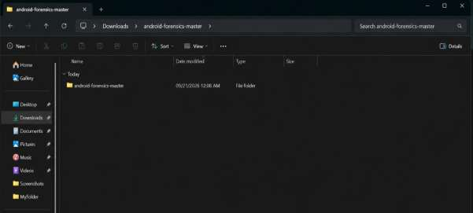
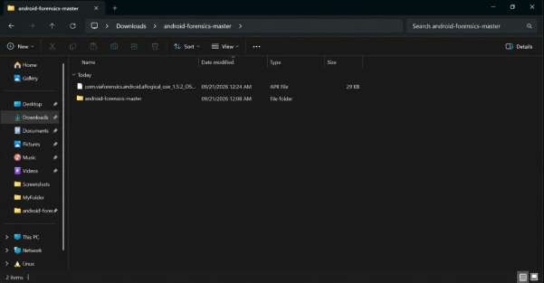
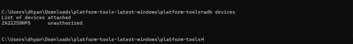
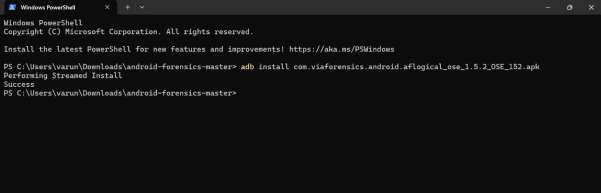
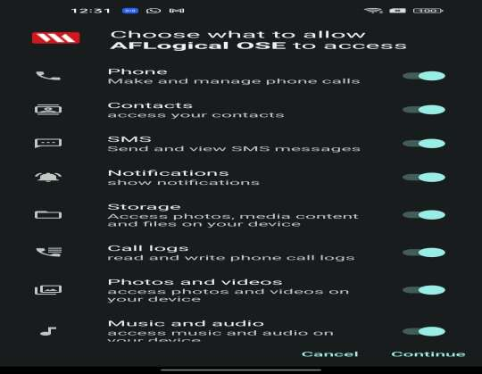
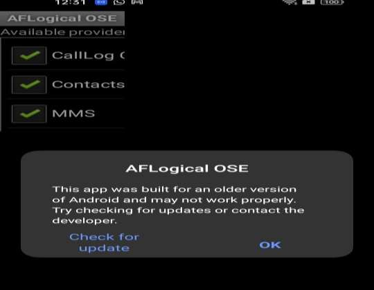
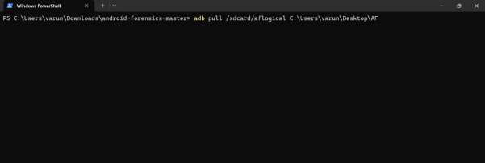
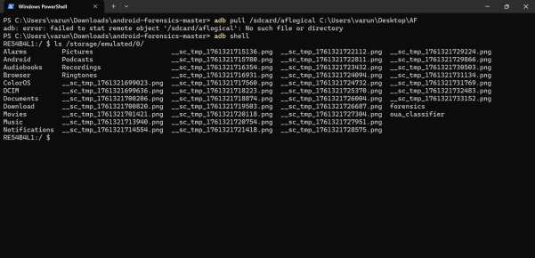

Exp no :07 Date :

# Use AFLogical OSE to Extract Data from an Android Device

## Description

AFLogical OSE (Open Source Edition) is a tool designed for logical data extraction from Android devices. As part of the Open Source Android Forensics project, it collects non-file system data like contacts, messages (SMS/MMS), and call logs without needing root access.

## Step 1: Prepare Your Environment

1. Download AFLogical OSE:
   - Visit the AFLogical OSE GitHub page and download the latest release, or clone the repository using Git.
2. Install Java:
   - AFLogical OSE requires Java to run. Ensure Java is installed on your machine.
3. Install Android Debug Bridge (ADB):
   - Download ADB (a command-line tool for device communication) from the Android Developer's website.
   - Install it on your system and add it to your system's PATH environment variable for easy access from the command line.
4. Enable USB Debugging on the Android Device:
   - Go to Settings > About Phone and tap Build Number seven times to enable Developer Options.
   - Go to Settings > Developer Options and enable USB Debugging.



## Step 2: Connect the Android Device to Your Computer



1. Connect via USB:
   - Use a USB cable to connect the Android device to your computer.
2. Verify ADB Connection:
   - Open Command Prompt/Terminal and run the following command:

```bash
adb devices
```

   - Verification: The device should be listed, confirming that the ADB connection is ready.



## Step 3: Extract Data Using AFLogical OSE

1. Push the APK to the Android Device:
   - Navigate to the AFLogical OSE directory in your terminal.
   - Run the command to install the AFLogical OSE APK on the device:

```bash
adb install aflogical.apk
```



2. Launch the AFLogical OSE App on the Device:
   - On the Android device, open the newly installed AFLogical app.
3. Select and Start Data Extraction:
   - Select the desired data types (e.g., contacts, SMS, MMS, call logs) from the app's options.
   - The app will start the extraction process, storing the data in .csv files on the device’s storage, typically in a directory named aflogical.



## Step 4: Transfer Extracted Data to Your Computer



1. Use ADB to Pull Data:
   - After extraction is complete, transfer the collected data files from the Android device to your computer using the adb pull command:

```bash
adb pull /sdcard/aflogical /path/to/destination
```



Note: Replace `/path/to/destination` with the desired save location on your computer.

2. Verify the Data:
   - Navigate to the destination directory and check the .csv files to ensure all required data has been successfully transferred.

## Step 5: Analyze the Extracted Data

1. Open the CSV Files:
   - Use applications like Excel, Google Sheets, or a text editor to open and analyze the .csv files containing the extracted logical data.
2. Review and Document:
   - Carefully review the data for any relevant evidence or information.
   - Document all findings and prepare a comprehensive report.



## Step 6: Clean Up

1. Uninstall AFLogical OSE:
   - Once data extraction is complete and verified, safely uninstall the app from the Android device:

```bash
adb uninstall com.viaforensics.android.aflogical
```

2. Disconnect the Device:
   - Safely disconnect the Android device from your computer.

By following these steps, you successfully perform a logical extraction on an Android device using AFLogical OSE, a valuable technique in digital forensic investigations.

## Result:

The experiment using Aflogical OSE was successfully performed. The tool efficiently extracted logical data such as contacts, messages, and media files from the mobile device, demonstrating its usefulness in mobile forensic data acquisition.
