# Use Autopsy to create a case and import evidence

Exp no :05 Date :

## Description

Autopsy is an open-source digital forensics platform used for analyzing and extracting data  
from digital devices. Here's a step-by-step process on how to use Autopsy for a basic forensic  
investigation:

Drive link:  
https://drive.google.com/drive/u/1/folders/1ilSFY7Tqn2L7AjQGhq8yJ8kixc_xTU-v

Download files: 4Dell Latitude CPi.E01, 4Dell Latitude CPi.E02

## 1. Installation

- **Download and Install:** Autopsy can be downloaded from the official website. Follow the installation instructions based on your operating system (Windows, Linux, or macOS).

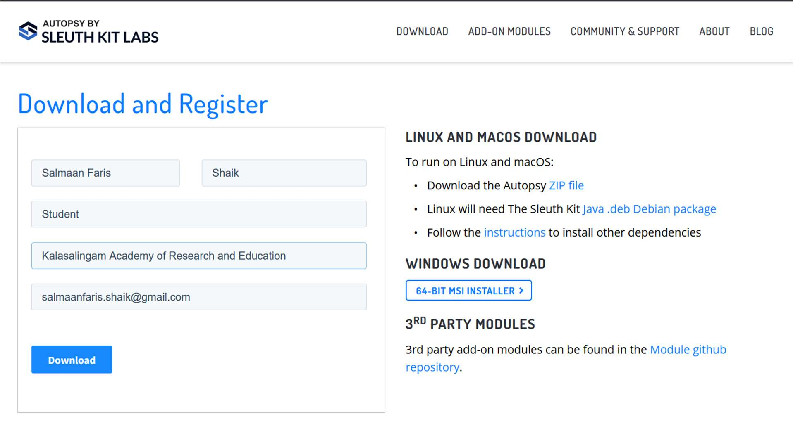

## 2. Starting a New Case

- **Open Autopsy:** Launch the application after installation.
- **Create a New Case:**
  - Click on New Case.
  - Enter the case name and location where the case data will be stored.
  - Fill in the details like the case number, examiner's name, etc., and click Next.

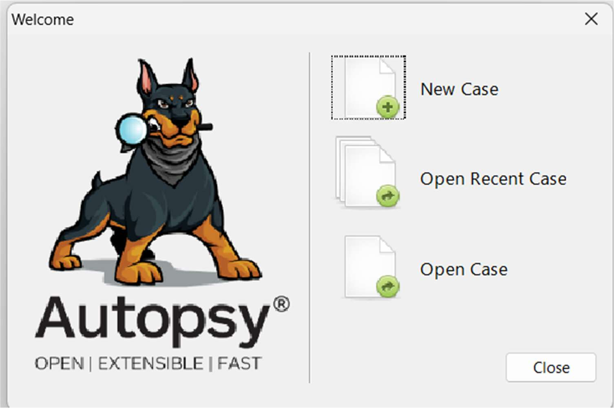

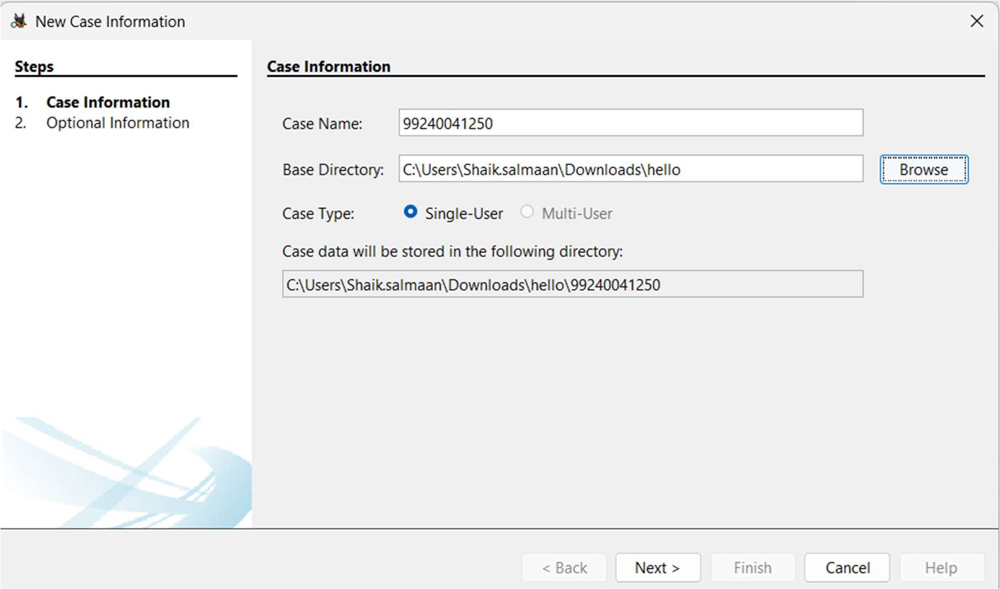

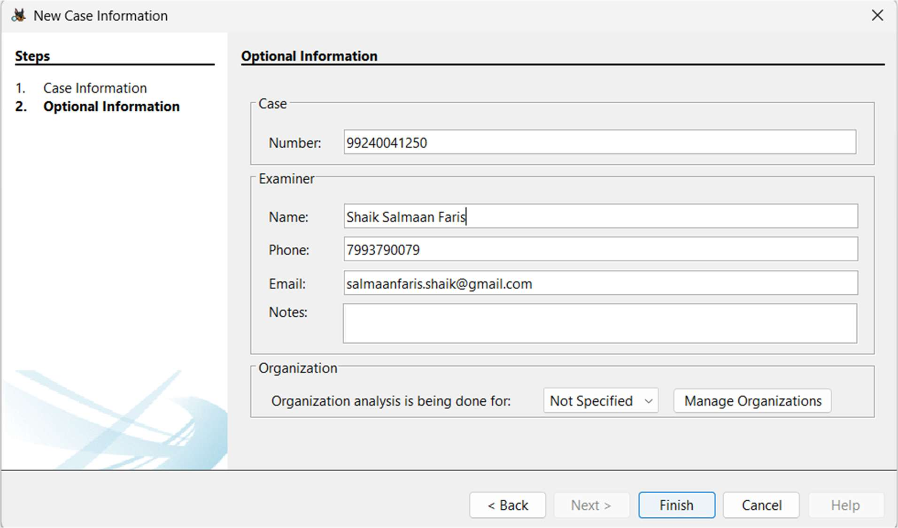

## 3. Adding a Data Source

- **Choose the Type of Data Source:**
  - After creating a case, you'll be prompted to add a data source.
  - You can add disk images, directories, logical files, or local disks.
- **Select the Data Source:**
  - Browse to the location of the image file (e.g., .E01, .dd, or .raw), physical disk, or directory you want to analyze.
  - https://drive.google.com/drive/u/1/folders/1ilSFY7Tqn2L7AjQGhq8yJ8kixc_xTU-v
- **Configure Ingest Modules:**
  - Autopsy allows you to select specific analysis modules such as File Type Identification, Keyword Search, Hash Lookup, etc.
  - You can enable or disable these based on your investigation needs.
- **Start Analysis:** Click Next to start the analysis.

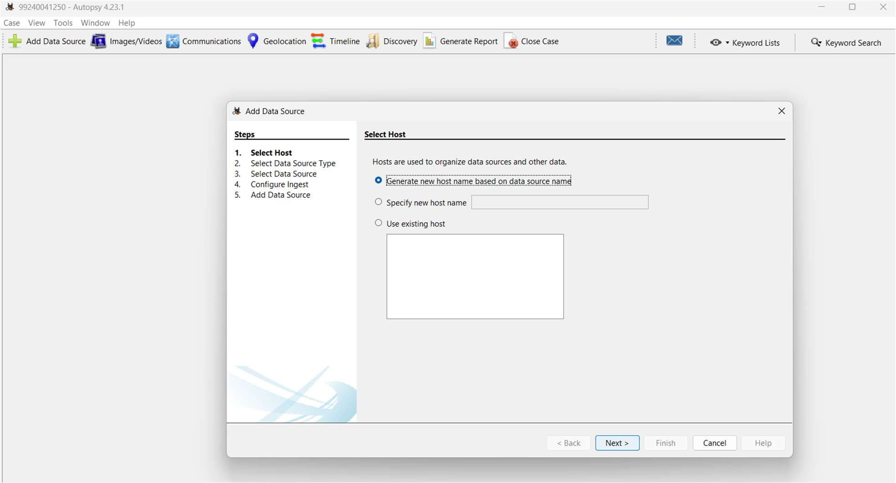

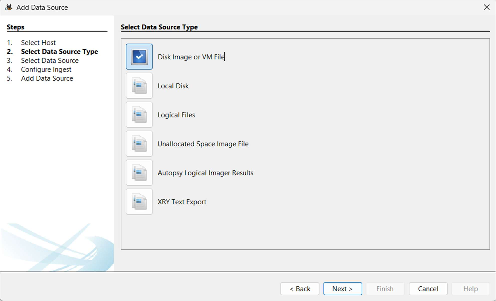

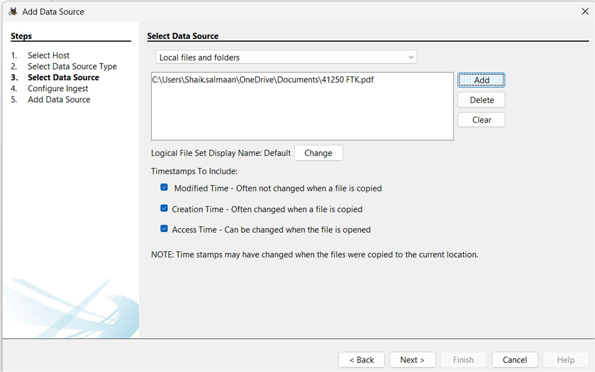

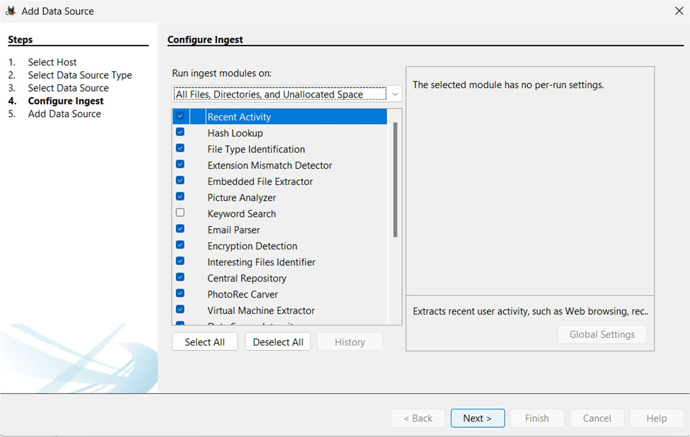

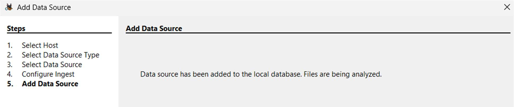

## 4. Initial Analysis and Overview

- **Ingest Progress:** As Autopsy processes the data source, you'll see the progress in the lower-left corner.
- **Explore the Resulting Artifacts:**
  - Autopsy automatically categorizes findings such as web artifacts, file system metadata, and communication records.
- **Use the Tree Viewer:**
  - On the left pane, you’ll see a tree structure where you can explore different aspects like File System, Web History, Email, etc.

## 5. Detailed Analysis

- **Keyword Search:**
  - You can perform specific keyword searches using the Keyword Search module.
  - Use pre-configured lists or enter custom keywords.
- **File Analysis:**
  - Navigate through files and folders under the File Types or File System section.
  - Open, view, or export files for further examination.
- **Timeline Analysis:**
  - Use the Timeline module to visualize events based on timestamps.
- This can help track user activity over time.
- **Hash Analysis:**
  - Compare file hashes with known databases to identify known good or bad files.

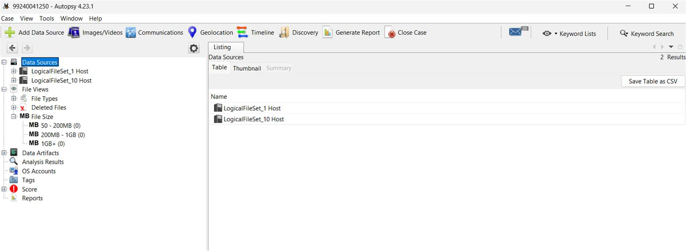

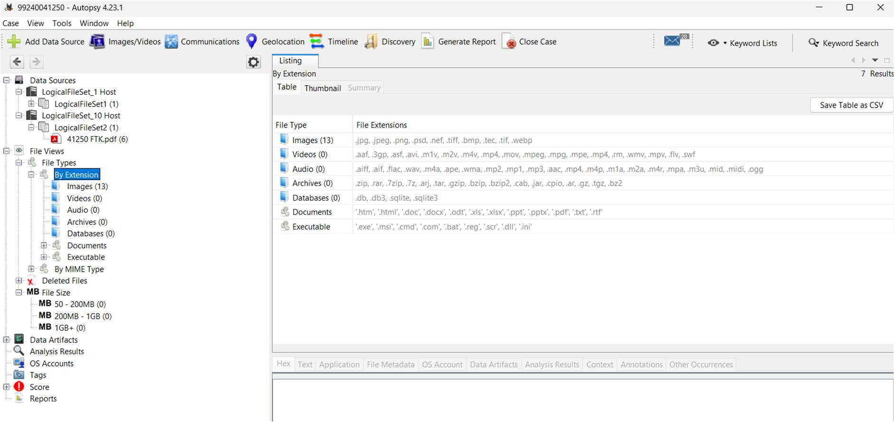

## 6. Reporting

- **Generate a Report:**
  - After analyzing the data, click on Generate Report from the toolbar.
  - Choose the type of report (HTML, CSV, Excel, etc.).
  - Select which parts of the analysis you want to include in the report.
- **Export Findings:**
  - Export individual files or artifacts that you need for your report or further analysis.
- **Final Review:**
  - Review the report to ensure it includes all relevant information.

- Save or print the report for use in your case.

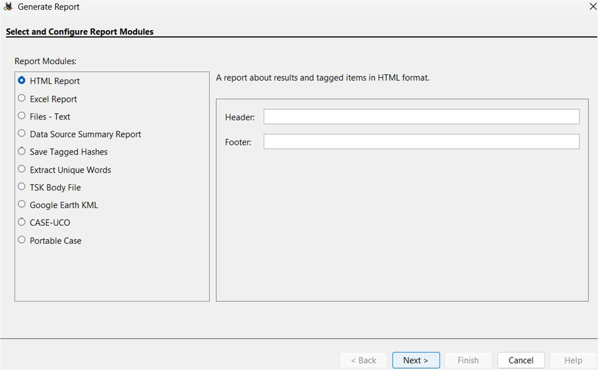

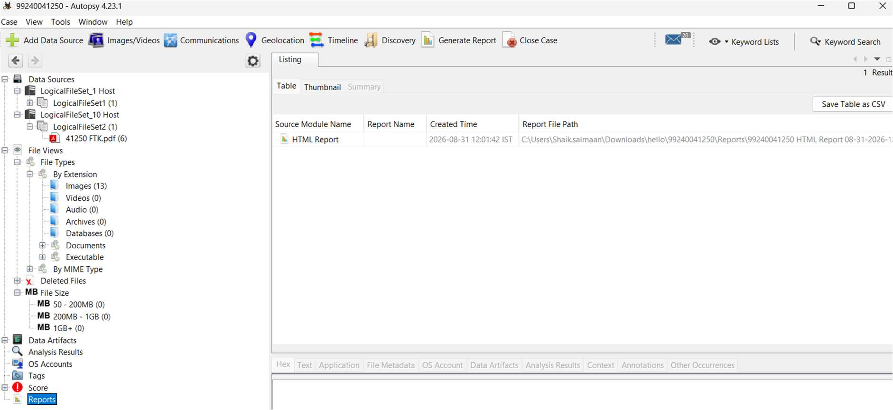

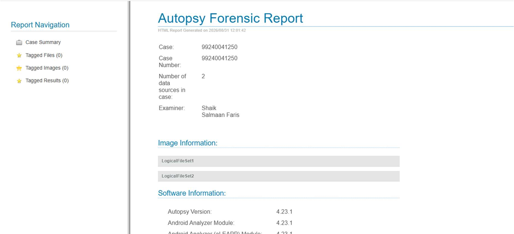

## 7. Case Closure

- **Close the Case:**
  - Once you have completed your investigation, close the case within Autopsy.
- **Archiving:**
  - Ensure all data and reports are properly archived according to your organization's policies.

## 8. Advanced Features (Optional)

- **Custom Ingest Modules:**
  - Autopsy allows for custom modules to be added if you need specific analysis tools not included by default.
- **Collaboration:**
  - Autopsy can be configured for multi-user cases if you’re working in a team environment.
