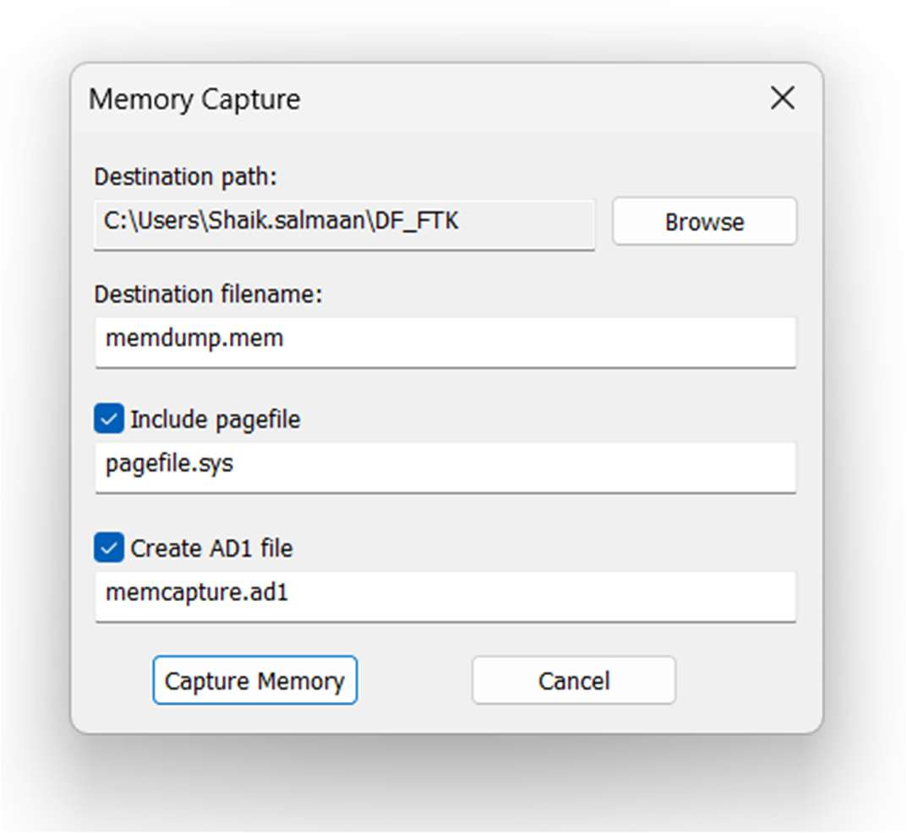
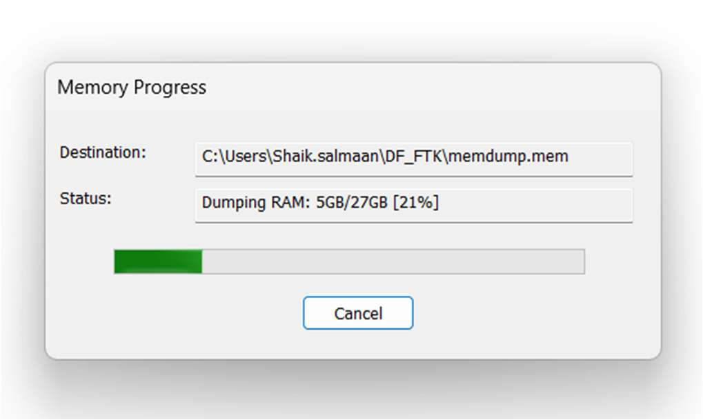
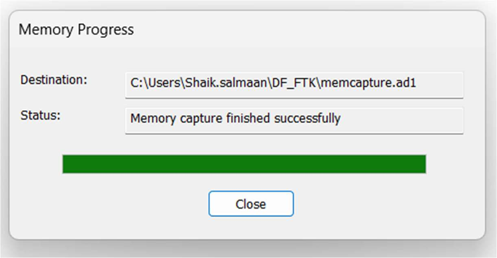
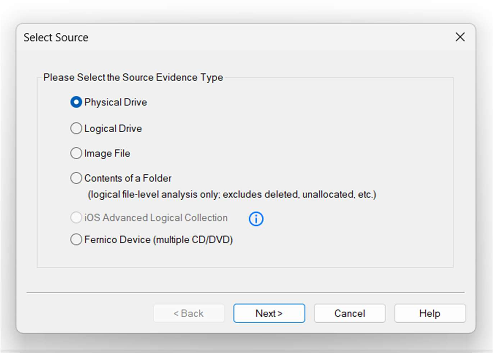
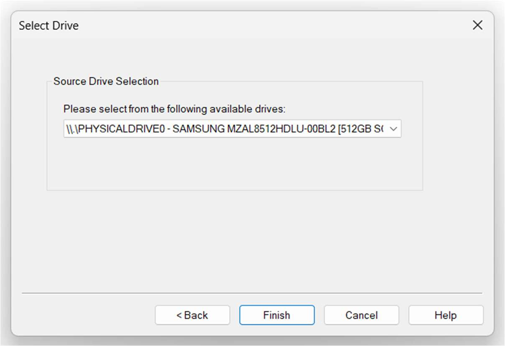
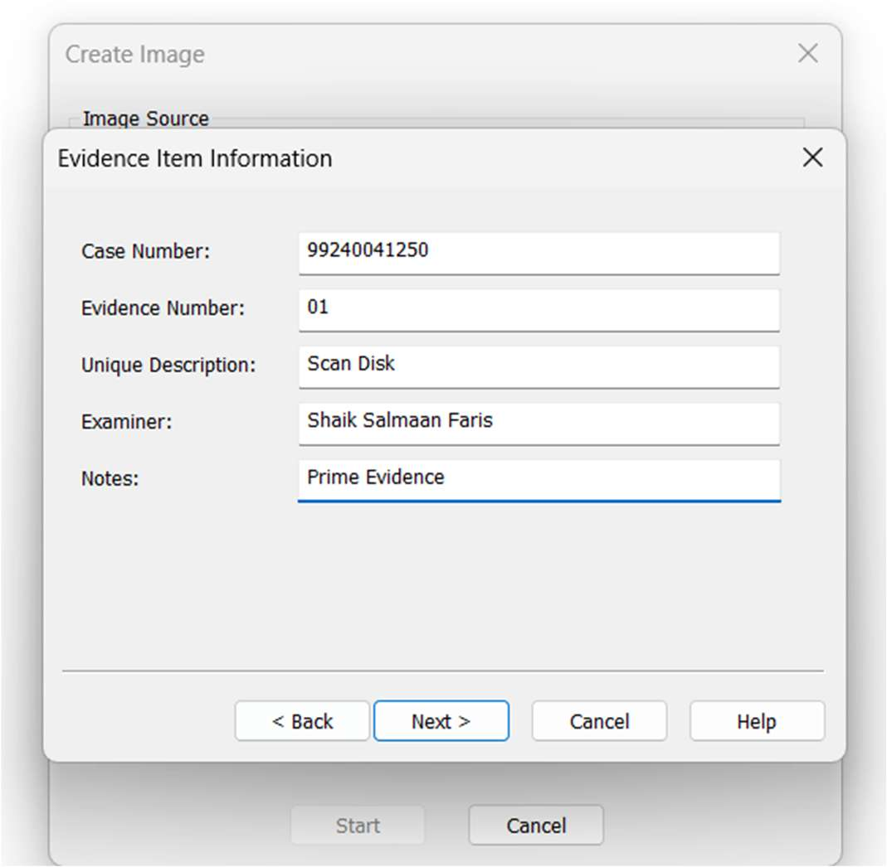
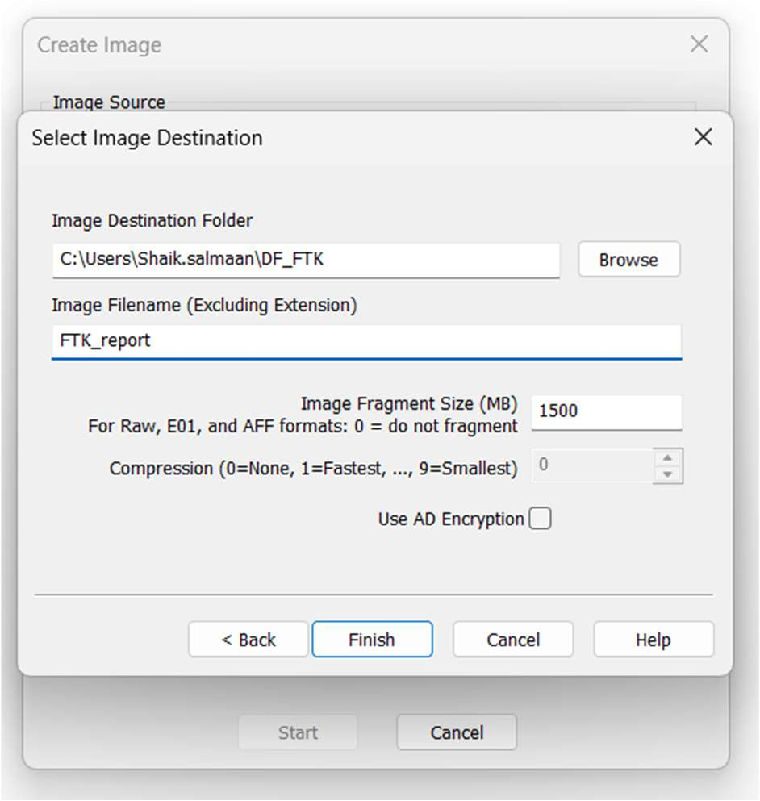
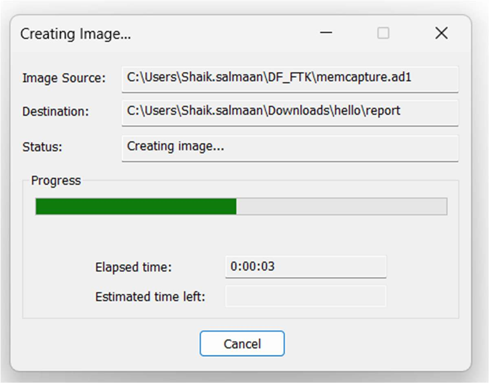
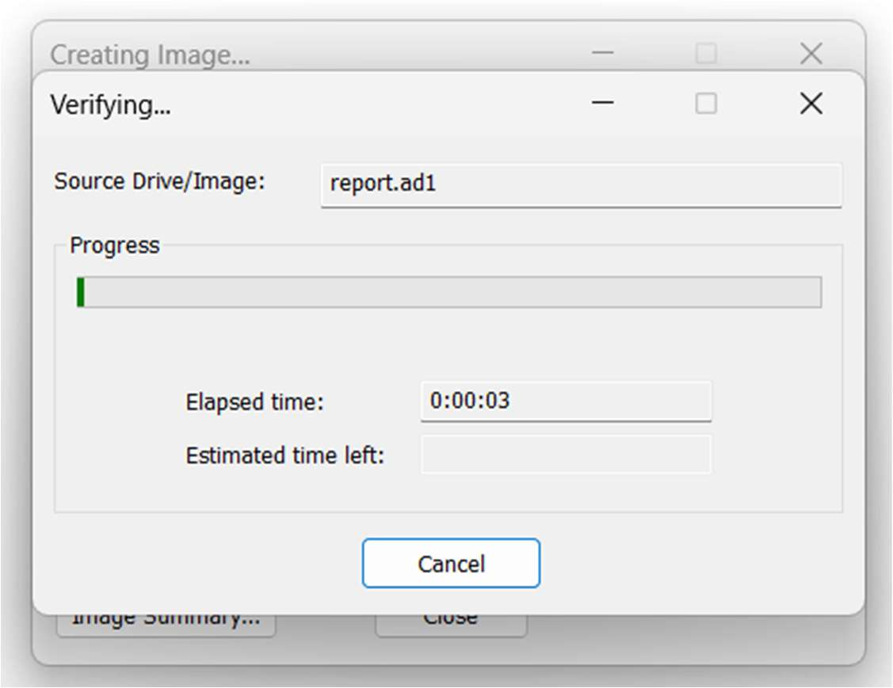
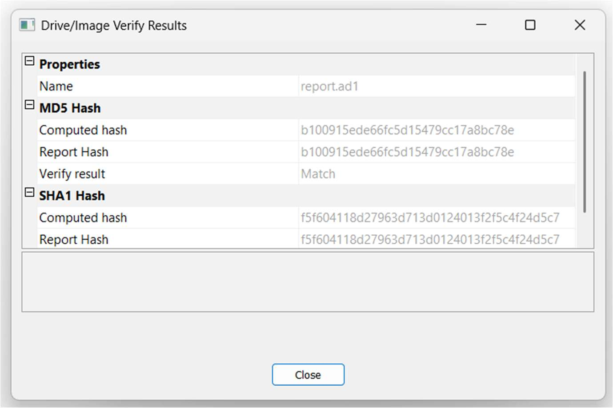

Exp no :01                                                                                                 Date :

Evidence Acquisition Using AccessData FTK Imager

Description

Forensic Toolkit or FTK is a computer forensics software product made by AccessData. This

is a Windows based commercial product. For forensic investigations, the same development

team has created a free version of the commercial product with fewer functionalities. This

FTK Imager tool is capable of both acquiring and analyzing computer forensic evidence.

The evidence FTK Imager can acquire can be split into two main parts. They are:

- Acquiring volatile memory

- Acquiring non-volatile memory (Hard disk)

There are two possible ways this tool can be used in forensics image acquisitions:

- Using FTK Imager portable version in a USB pen drive or HDD and opening it

directly from the evidence machine. This option is most frequently used in live

data acquisition where the evidence PC/laptop is switched on.

- Installing FTK Imager on the investigator’s laptop.

In this case the source disk should be mounted into the investigator’s laptop via

write blocker. The write blocker prevents data being modified in the evidence

source disk while providing read-only access to the investigator’s laptop. This

helps to maintain the integrity of the source disk.

Acquiring volatile memory using FTK Imager

The FTK Imager tool helps investigators to collect the complete volatile memory (RAM)

of a computer. The following steps will show you how to do this.

Open FTK Imager and navigate to the volatile memory icon (capture memory).

---

NOTE: This tool provides options to include pagefile and AD1 files when acquiring the

volatile memory.

Pagefile: The pagefile (pagefile.sys) is used in Windows operating systems as volatile

memory due to limitation of physical random-access memory (RAM). It is located under the

“C” partition ready to use as volatile memory when the existing RAM capacity is exceeded.

So this file can have quite a bit of valuable data when considering the volatile memory.

Therefore, it is recommended to capture and collect this file in the acquisition.

AD1 file: AD1 is the FTK imager image file. The investigator has the option to create an AD1

file for later use.

Clicking the “capture memory” button will start acquiring the volatile memory.

---

NOTE: Once the acquisition has completed, the destination folder will have the acquired

memory with the file extension of “.mem”.

Acquiring non-volatile memory (Disk Image) using FTK Imager

As previously stated, this same tool can be used to collect a disk image as well. Open FTK

Imager
and
navigate
to
“Create
Disk
Image”.

NOTE: FTK Imager is capable of acquiring physical drives (physical hard drives), logical

drives (partitions), image files, contents of a folder, or CDs/DVDs. Investigators can connect

external HDDs into the collection computer

via write blocker and use the “logical drive” option to select the mounted HDD as a

partition. Collecting Physical Drives

Select the “Physical Drive” option.

Select the drive you need to acquire and click “Finish”.

---

Raw (dd): This is the image format most commonly used by modern analysis tools. These

raw file formatted images do not contain headers, metadata, or magic values. The raw format

typically includes padding for any memory ranges that were intentionally skipped (i.e.,

device memory) or that could not be read by the acquisition tool, which helps maintain

spatial integrity (relative offsets among data).

SMART: This file format is designed for Linux file systems. This format keeps the disk

images as pure bitstreams with optional compression. The file consists of a standard 13-

byte header followed by a series of sections. Each section includes its type string, a 64-bit

offset to the next section, its 64-bit size, padding, and a CRC, in addition to actual data or

comments, if applicable.

E01: this format is a proprietary format developed by Guidance Software’s EnCase. This

format compresses the image file. An image with this format starts with case information

in the header and footer, which contains an MD5 hash of the entire bit stream. This case

information contains the date and time of acquisition, examiner’s name, special notes and

an optional password.

AFF: Advance Forensic Format (AFF) was developed by Simson Garfinkel and Basis

Technology. Its latest implementation is AFF4. The goal is to create a disk image format

that does not lock the user into a proprietary format that may prevent them from being able

to properly analyze it.

Now enter the case details.

---

Add an image destination (where the image file will be saved), image file name and

fragment size.

Image Fragment Size (MB): this option will separate the image file into multiple images and

save them in the same destination. If you need only one file instead of creating multiple

fragmented images, you must set the image fragment size to “0”.

Select the “verify images after they are created” option. This will verify the hash values

once the image has created. In order to ensure integrity, it is recommended to use this

---

option. However, this will increase the time taken to acquire your evidence, especially if

you’re dealing with a large disk image size.

Click “start” to start acquiring.

Once acquiring is complete, it will create a text file including all the information it has

acquired.

Hash values are matched.

---

