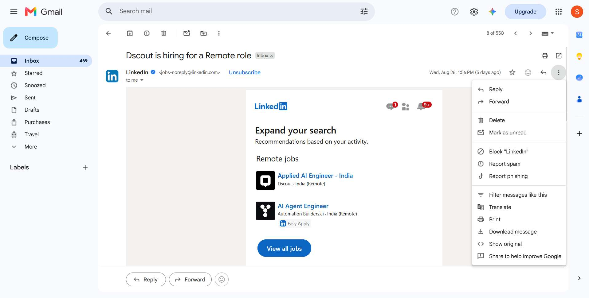
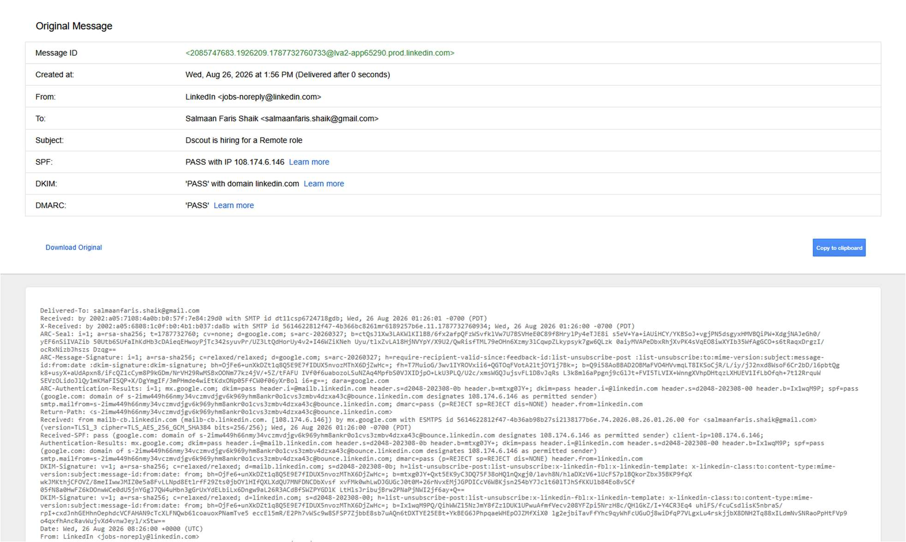
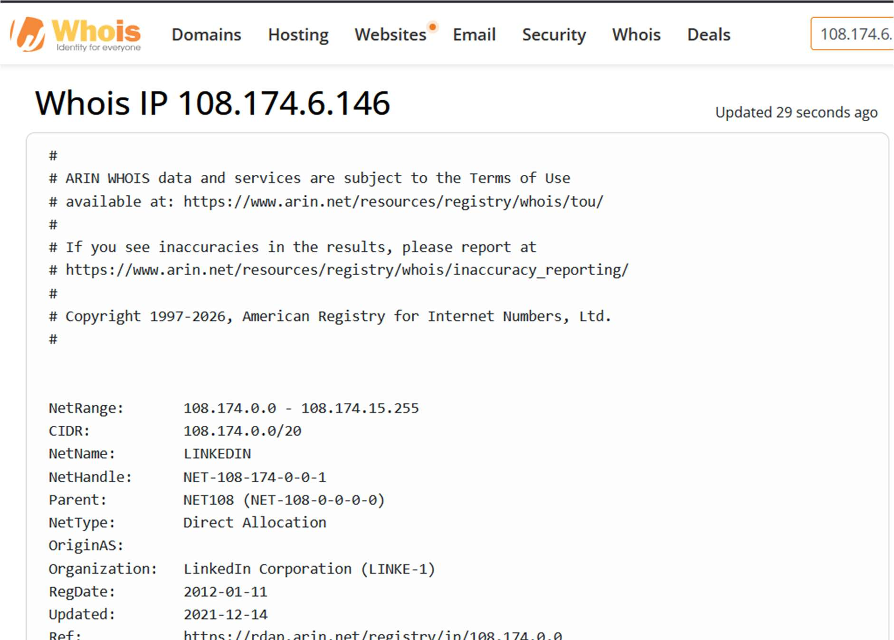
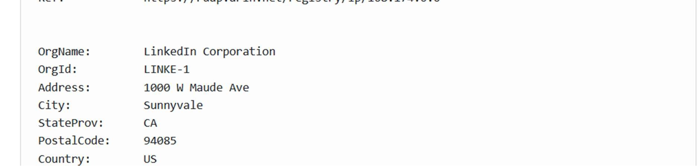
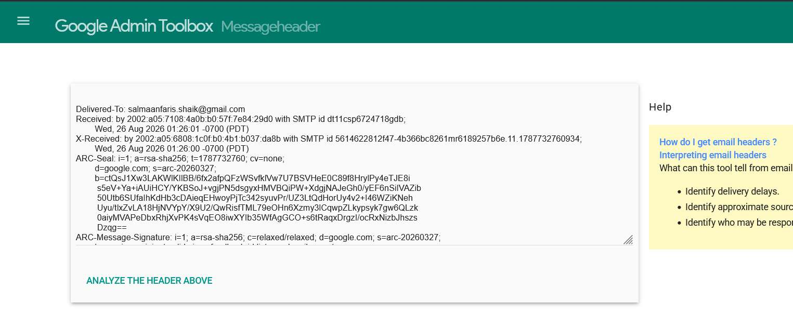
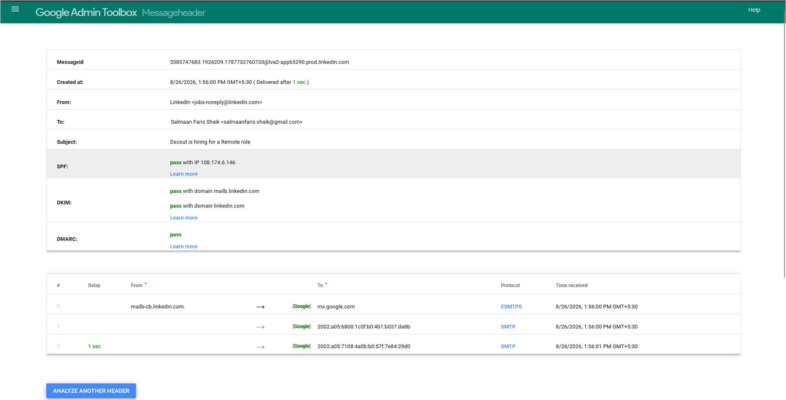

**Exp no :04**  
**Date :**

# Analyze email headers and detect email spoofing using
# MHA (Mail Header Analyzer)

**Description:**

Here's a step-by-step guide on how to execute and analyze an email header:

## 1. Access the Email Header

- **Gmail:** Open the email, click the three dots (More) in the upper right corner, and select "Show original."
- **Outlook:** Open the email, click on "File," then "Properties," and find the "Internet headers" box.
- **Yahoo:** Open the email, click on the three dots (More), and select "View raw message."

## 2. Copy the Email Header

- Once you access the header, copy all the text that appears. This text contains various metadata fields about the email's journey from the sender to your inbox.

## 3. Identify Key Header Fields

- **From:** The sender’s email address.
- **To:** The recipient's email address.
- **Date:** The date and time the email was sent.
- **Subject:** The email's subject line.
- **Return-Path:** The return address if the email bounces.
- **Received:** A list of servers the email passed through on its way to the recipient. This is usually the most critical part of header analysis.
- **Message-ID:** A unique identifier for the email.
- **SPF (Sender Policy Framework) / DKIM (DomainKeys Identified Mail):** Indicators of email authentication.

## 4. Analyze the ‘Received’ Fields

- The Received fields show the path the email took from the sender to the recipient. These fields are listed in reverse order (from the last server to the first).
- Each Received line will show:
  - **The sending server's hostname/IP address.**
  - **The receiving server's hostname/IP address.**
  - **The date and time the email passed through.**

## 5. Check for IP Addresses and Hostnames

- Use tools like WHOIS or online IP lookup services to identify the geographical location and ownership of the IP addresses found in the Received lines.
- Check if any IP addresses are suspicious or if the hostname does not match the expected sending server.

## 6. Examine the SPF, DKIM, and DMARC Results

- **SPF:** Checks if the sender's IP is authorized to send emails for the domain.
  - **Pass:** Indicates the IP is authorized.
  - **Fail:** The IP is not authorized and could be a sign of spoofing.
- **DKIM:** Verifies that the email content has not been altered in transit.
  - **Pass:** The email has not been tampered with.
  - **Fail:** The email content may have been altered.
- **DMARC:** A policy that uses SPF and DKIM to authenticate the email.
  - **Pass:** Indicates alignment with SPF/DKIM policies.
  - **Fail:** Indicates possible spoofing or tampering.

## 7. Analyze the ‘Message-ID’

- The Message-ID is unique to each email. It usually includes the domain of the sending server.
- Check if the domain in the Message-ID matches the sender's domain. If not, it could be a sign of spoofing.

## 8. Look for Anomalies

- **Mismatch in Email Domains:** Check if the From domain matches the domains in Return-Path, Message-ID, and other authentication results.
- **Strange IP Addresses:** Be wary of IP addresses that do not match the known sending server or are from unexpected locations.
- **Suspicious Time Stamps:** Check for significant time discrepancies in the Received lines, which could indicate delays or rerouting.

## 9. Use Online Tools

- Use online email header analysis tools like **MXToolbox** or **Google's G Suite Toolbox** to automatically parse and analyze the email header.

## 10. Document and Report Findings

- Document all your findings, especially if you detect phishing or spoofing.
- Report suspicious emails to your IT department or email provider for further investigation.

