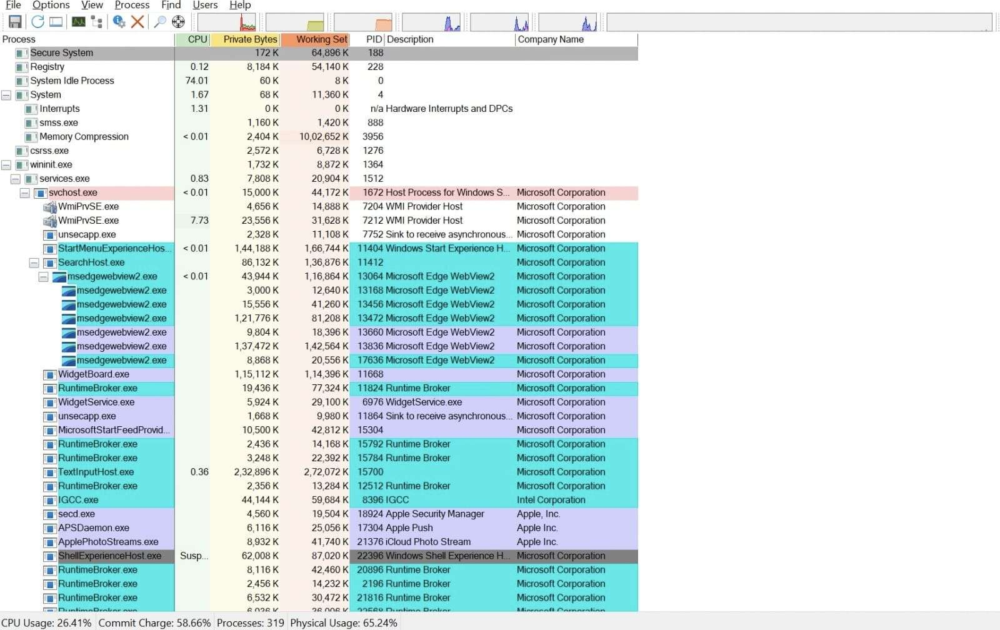
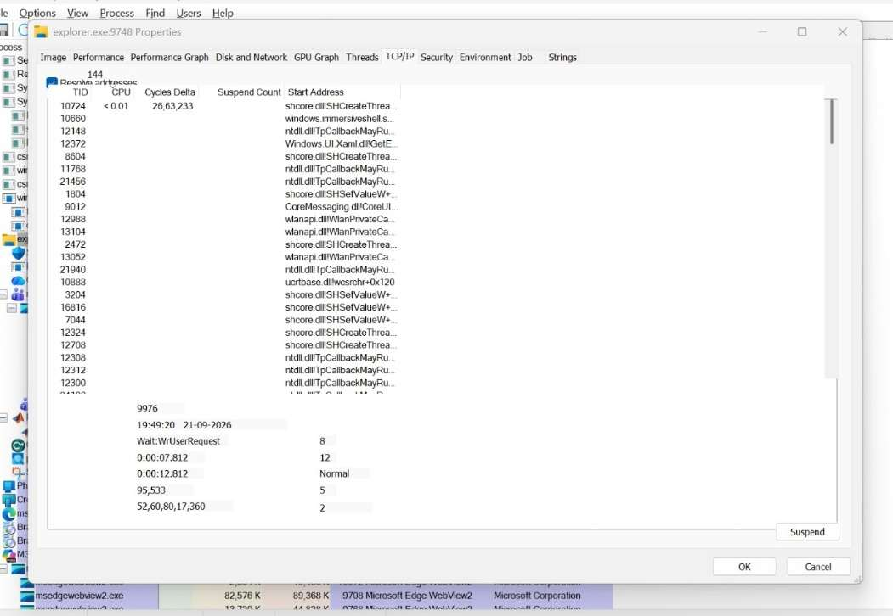
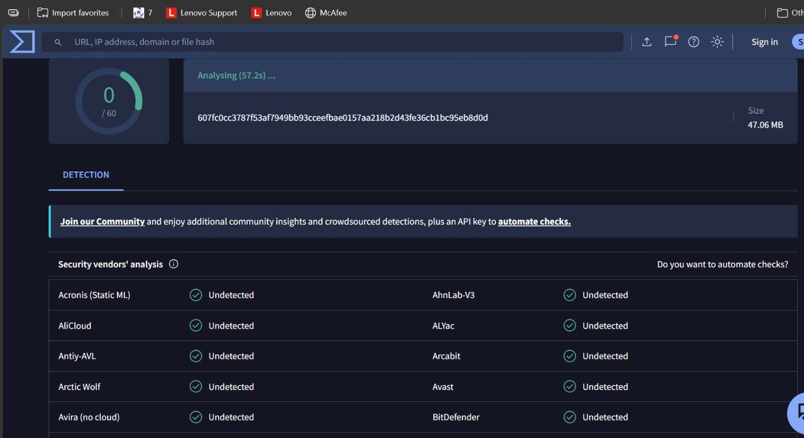
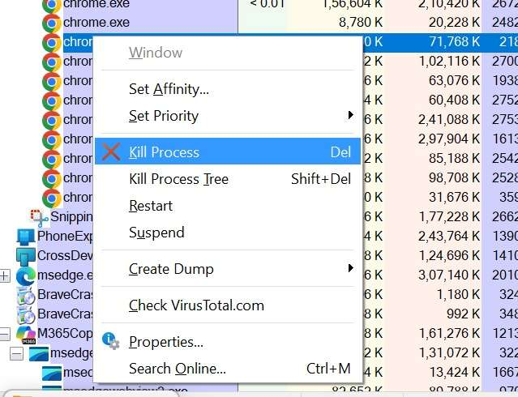
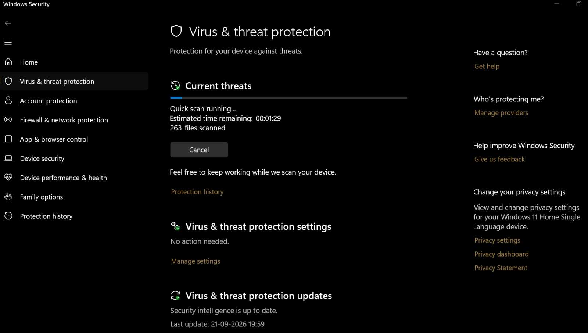

# Using Process Explorer to Identify Suspicious Processes

Exp no :08 Date :

## Aim

To use Microsoft Sysinternals Process Explorer to monitor system activities and identify any suspicious or malicious processes running on a Windows computer.

## Requirements

- Windows operating system
- Internet connection
- Process Explorer (from Microsoft Sysinternals)
- Optional: Antivirus software (e.g., Windows Defender, Malwarebytes)

## Description

- Process Explorer is a part of the Microsoft Sysinternals Suite. It is a powerful tool used to view detailed information about system processes.
- It helps investigators and administrators analyze active processes, detect suspicious behavior, monitor CPU and memory usage, and verify process authenticity using digital signatures.

## Step-by-Step Process

### Step 1: Download and Setup Process Explorer

1. Go to the official Microsoft Sysinternals website:
   https://learn.microsoft.com/en-us/sysinternals/downloads/process-explorer
2. Click Download Process Explorer.
3. Extract the downloaded ZIP file to a folder.
4. Right-click `procexp64.exe` (for 64-bit) or `procexp.exe` (for 32-bit) → select Run as Administrator.

### Step 2: Understand the Interface

1. The main window displays all running processes in a hierarchical tree view.
2. Each process shows details such as PID, CPU usage, memory usage, and company name.
3. Color codes represent process states:

- Green — Newly started processes
- Red — Terminated processes
- Light Blue — Processes running under the current user
- Pink — Suspended processes

### Step 3: Identify Suspicious Processes

1. Look for unfamiliar or oddly named processes (e.g., xkdjeo.exe, randomname123.exe).
2. Check the Company Name and Description:
   - Legitimate software usually shows known publishers like Microsoft, Intel, or Adobe.
3. Right-click the process → Properties → go to the Image tab.
4. Verify the Path of the executable file:
   - Safe: `C:\Windows\System32\`
   - Suspicious: `C:\Users\<User>\AppData\Temp\` or `Downloads\`
5. Check for Digital Signature:
   - Valid signature = trusted developer
   - No signature or invalid = possibly malicious

## Step 4: Analyze Process Behavior

- Observe CPU, Memory, and I/O usage columns.
- If a small or unknown process consumes excessive CPU or memory, it may be malicious.
- Right-click the process → Properties → go to the TCP/IP tab.
- Check if it communicates with unknown external IP addresses.
- Examine Handles and DLLs tabs for suspicious loaded files or libraries.

## Step 5: Verify Process Legitimacy

1. Search the process name on Google.
   Example: `svchost.exe` vs `svhost.exe` (one letter missing — suspicious).
2. Visit https://www.virustotal.com
   - Upload the process file or search its name to verify if it’s reported as malware.
3. Cross-check with ProcessLibrary.com or official vendor websites for authenticity.

## Step 6: Take Appropriate Action

1. If the process is confirmed malicious:
   - Right-click the process → Kill Process to stop it.
   - Delete the corresponding executable file from its path.
2. If unsure:
   - Right-click → Suspend Process to stop it temporarily for investigation.
3. After removal:
   - Run a Full System Scan using Windows Defender or Malwarebytes to ensure no remnants remain.

## Step 7: Example Observation

You find faangpath_simple_template.pdf consuming 70% CPU.

- Path: `C:\Users\Admin\AppData\Temp\faangpath_simple_template.pdf`
- Digital Signature: None
- Company Name: Unknown
- Network Activity: Shows connections to unknown IPs in the TCP/IP tab
- Online Check: VirusTotal confirms it as a known trojan
- Action Taken: Suspended → Killed → Deleted file → Performed full antivirus scan

## Result

Using Process Explorer, suspicious processes were successfully identified by examining their CPU usage, path, digital signature, and network activity.

Confirmed malicious processes were terminated and removed to maintain system integrity.
