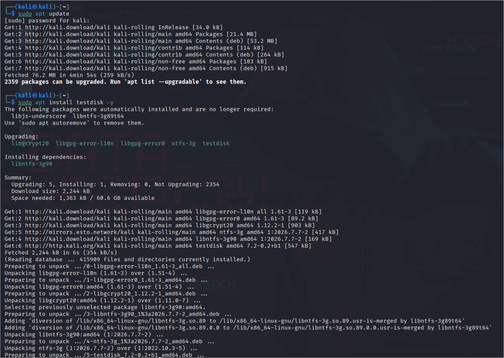
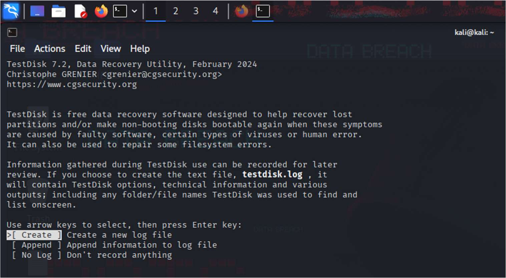
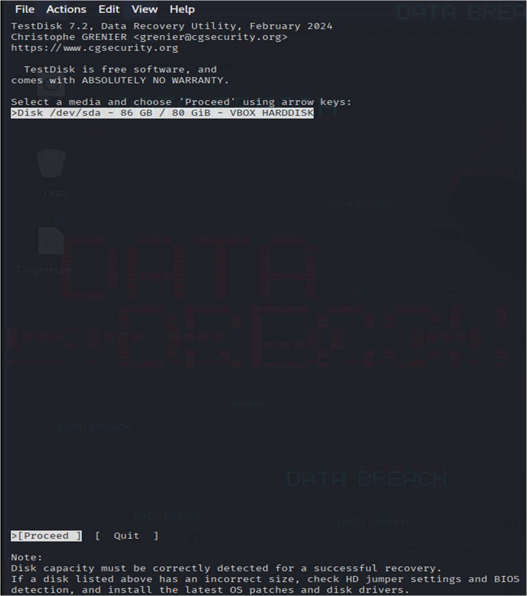
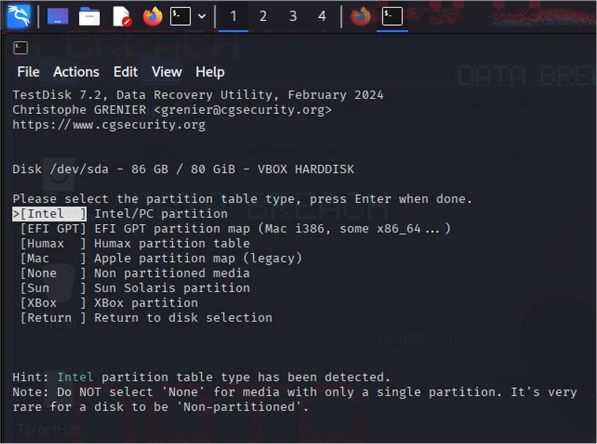
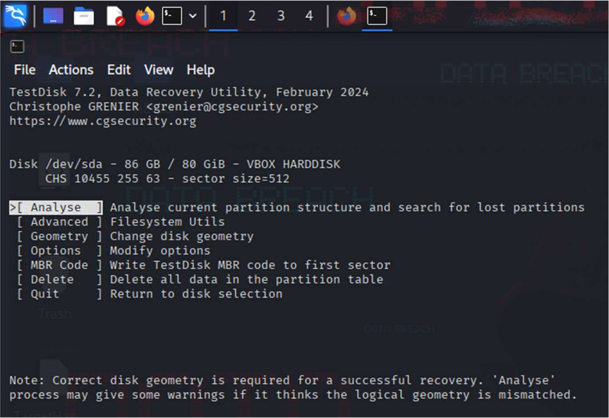
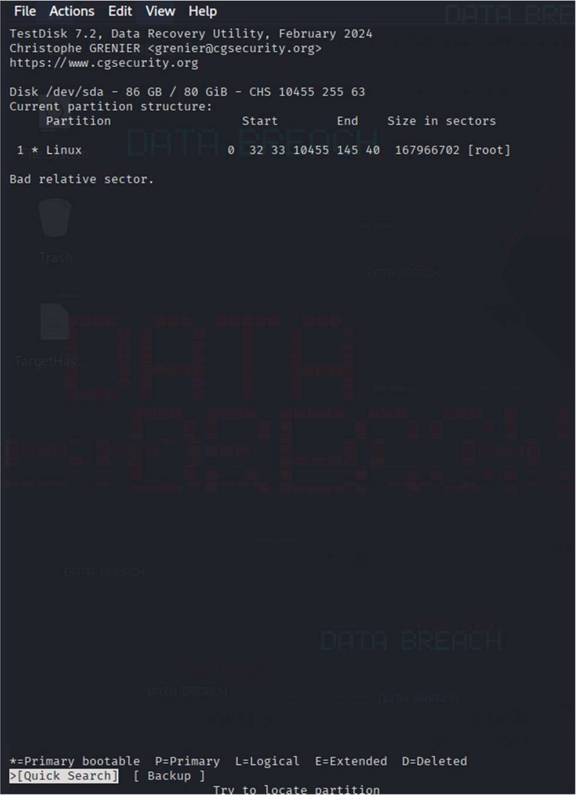
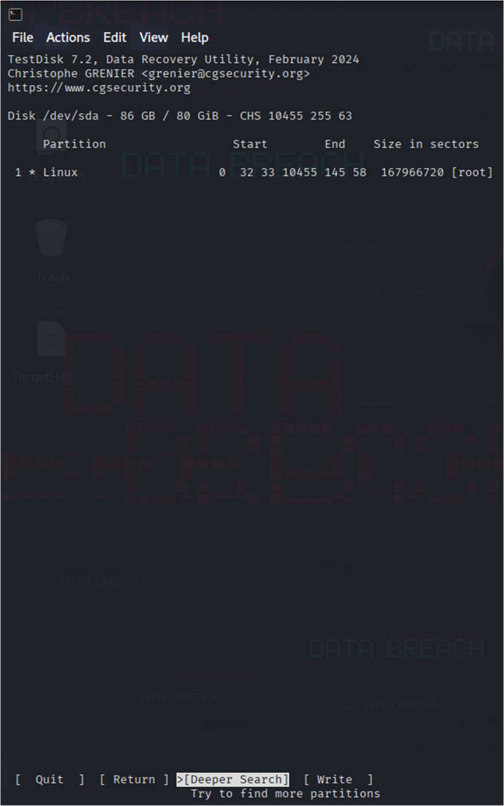
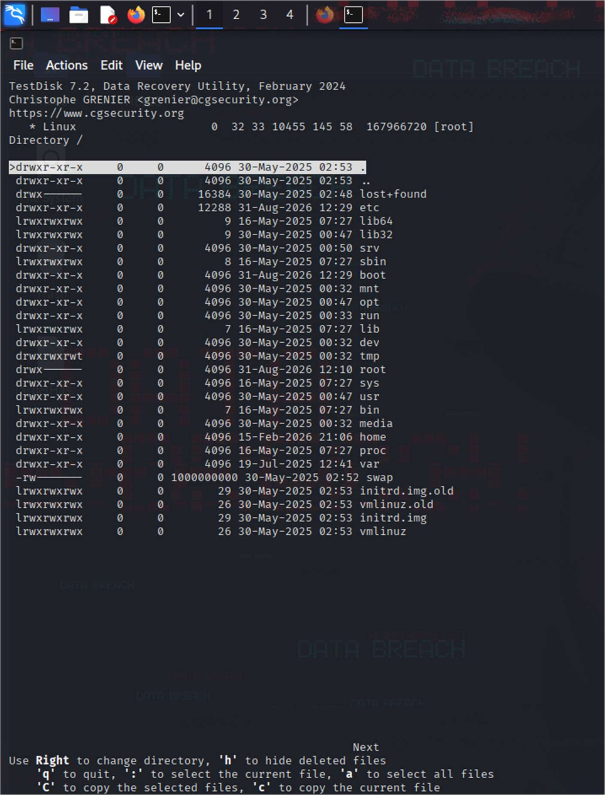
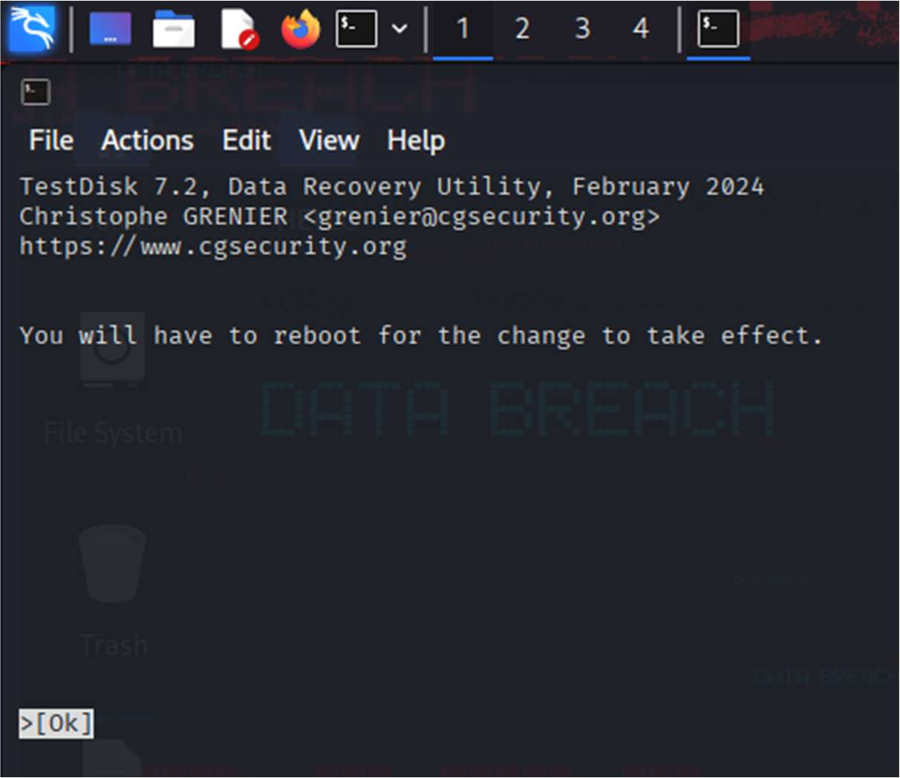

# Recover deleted or damaged files from a storage device using Test Disk

**Exp no :02**  
**Date :**

**Description:**

TestDisk step by step to recover a missing partition and repair a corrupted one.

## Log creation

- Choose Create to instruct Testdisk to create a log file containing technical information and messages, unless you have a reason to append data to the log or you execute TestDisk from read only media and must create the log elsewhere.
- Choose None if you do not want messages and details of the process to be written into a log file (useful if for example Testdisk was started from a read-only location).
- Press Enter to proceed.

## Disk Selection

All hard drives should be detected and listed with the correct size by TestDisk:

- Use up/down arrow keys to select your hard drive with the lost partition/s.
- Press Enter to Proceed.

If available, use raw device `/dev/sda*` for faster data transfer.

## Partition table type selection

TestDisk displays the partition table types.

- Select the partition table type - usually the default value is the correct one as TestDisk auto-detects the partition table type.
- Press Enter to Proceed.

## Current Partition Table Status

TestDisk displays the menus (also see TestDisk Menu Items).

- Use the default menu "Analyse" to check your current partition structure and search for lost partitions.
- Confirm at Analyse with Enter to proceed.

Now, your current partition structure is listed. Examine your current partition structure for missing partitions and errors.

The first partition is listed twice which points to a corrupted partition or an invalid partition table entry.

Invalid NTFS boot points to a faulty NTFS boot sector, so it's a corrupted filesystem.

Only one logical partition (label Partition 2) is available in the extended partition. One logical partition is missing.

- Confirm at Quick Search to proceed.

## Quick Search for Partitions

During the Quick Search, TestDisk has found two partitions including the missing logical partition labeled Partition 3.

- Highlight this partition and press p to list your files (to go back to the previous display, press q to Quit, Files listed in red are deleted entries).

All directories and data are correctly listed.

- Press Enter to proceed.

## Save the Partition table or search for more partitions

- When all partitions are available and data correctly listed, you should go to the menu Write to save the partition structure. The menu Extd Part gives you the opportunity to decide if the extended partition will use all available disk space or only the required (minimal) space.
- Since a partition, the first one, is still missing, highlight the menu Deeper Search (if not done automatically already) and press Enter to proceed.

It works, your files are listed, you have found the correct partition!

- Use the left/right arrow to navigate into your folders and watch your files for more verification

**Note:** FAT directory listing is limited to 10 clusters - some files may not appear but it doesn't affect recovery.

- Press q for Quit to go back to the previous display.
- The available status are Primary, * bootable, Logical and Deleted.

Using the left/right arrow keys, change the status of the selected partition from Deleted to Logical. This way you will be able to recover this partition.

TestDisk displays You have to restart your Computer to access your data so press Enter a last time and reboot your computer.
