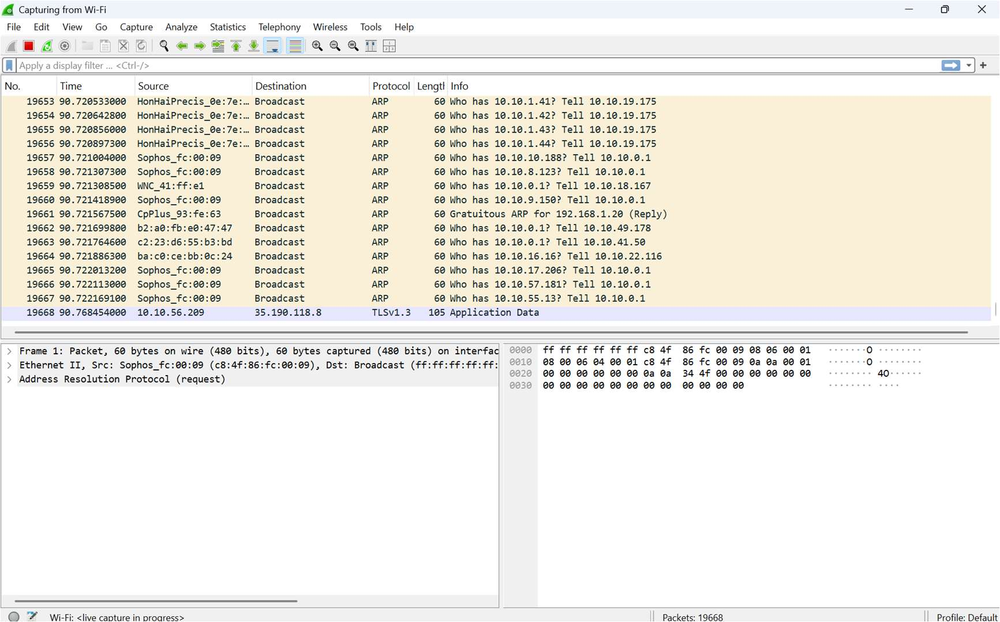
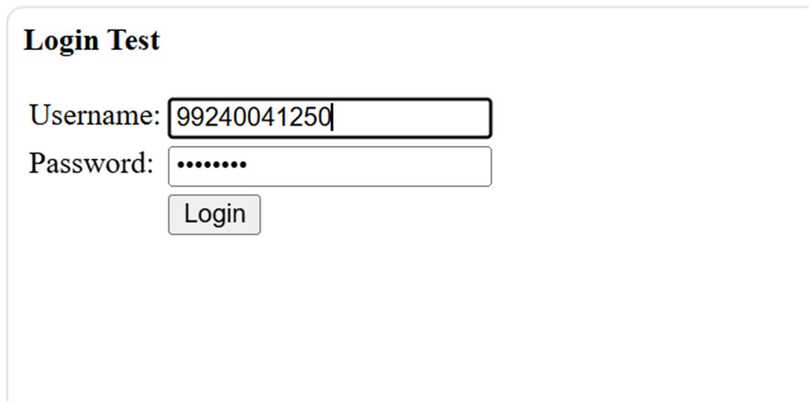
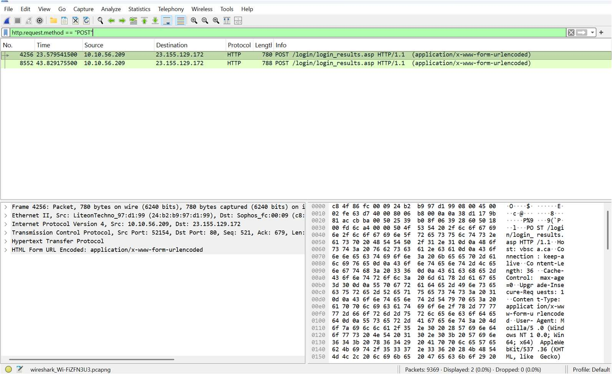
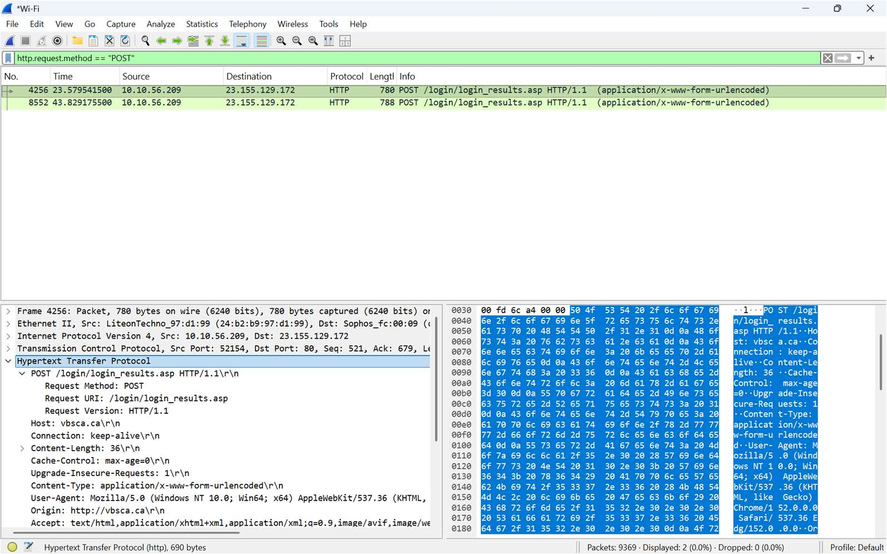
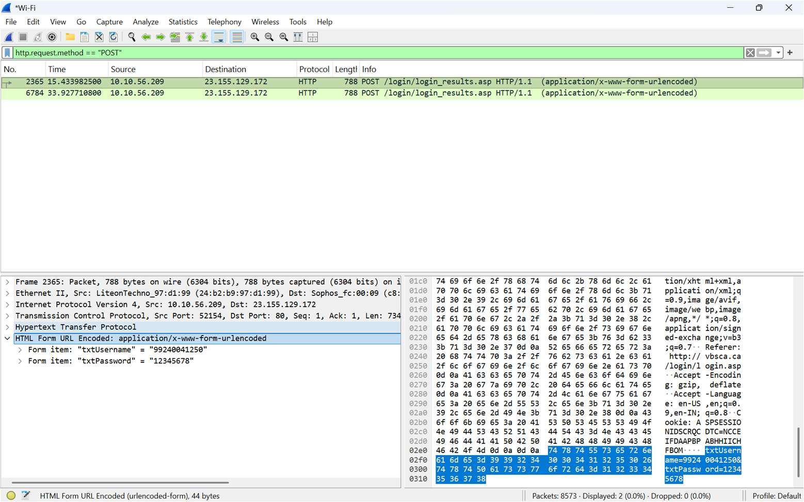

# Ex.No:03 Wireshark

## Password Capturing

Wireshark can capture not only passwords but any type of information transmitted over the network: usernames, email  
addresses, personal information, etc. As long as we can capture network traffic, Wireshark can sniff passing passwords.

In sniffing can include passwords for various protocols such as HTTP, FTP, Telnet, etc.  
the captured data can be used to  
troubleshoot network problems, but can also be used maliciously to gain unauthorized  
access to sensitive information.

So, here we will see how we can capture the password using the Wireshark network capture analyzer. and see the outputs of the following steps.

**Step 1:** First of all, open your Wireshark tool in your window or in Linux virtual machine.  
and start capturing the network. suppose I am capturing my wireless fidelity.



**Step 2:**  
After starting the packet capturing we will go to the  
website and login the credential on that website as you can see in the image



**Step 3:** Now after completing the login credential we will go and capture the password in Wireshark. for that we have to use some filter that helps to find the login credential through the packet capturing.



**Step 4:** Wireshark has captured some packets but we specifically looking for HTTP packets. so  
in the display filter bar we use some command to find all the captured HTTP packets. as you can  
`http`

**Step 5:** So there are some HTTP packets are captured but we specifically looking for  
form data that the user submitted to the website. for that, we have a separate filter

As we know that there are main two methods used for submitting form data from web  
pages like login forms to the server. the  
methods are-GET

**POST**

**Step 6:** So firstly for knowing the credential we use the first method and apply the filter  
for the GET methods as you can see below.

```text
http.request.method == "GET"
```

see in the below image the green bar where we apply the filter.

### GET method

As you can see in the image there are two packets where the login page was requested  
with a GET request as well, but

there is no form data submitted with a GET request.

**Step 7:** Now after checking the GET method if we didn’t find the form data, then we will  
try the POST method for that we will apply the filter on Wireshark as you can see.

```text
http.request.method == "POST"
```



As you can see we have a packet with form data click on the packet with user info and the  
application URL encoded. and click on the down-

HTML form URL Encoded where the login credential is found. login credential as it is the  
same that we filed on the website in step 2.

**Form**

**item**:"username"="99240041250"

**Form item**: "pass" = "12345678"


